# Innovatech Solutions — AWS hub-and-spoke omgeving (CS1-MA-NCA)

Startrepo bij het Analyse-, Ontwerp- en TCO-document. De volledige omgeving wordt met Terraform
uitgerold en daarna door GitHub Actions beheerd: een self-hosted runner in de Hub voert
`plan` en `apply` uit, bouwt de applicatie-image en zet die met een blue-green deployment
uit op ECS Fargate.

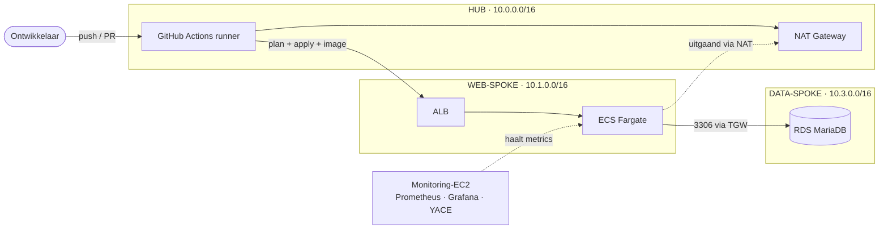

> **Status van de applicatie:** de huidige image (`app/`) is een statische NGINX-pagina met een
> `/healthz`-endpoint. Er is (nog) geen Flask- of Python-code in de repo. De ECS-taak krijgt wel
> al `DB_HOST`, `DB_PORT`, `DB_USERNAME` en `DB_PASSWORD` als env-variabele, zodat een
> applicatielaag zonder Terraform-wijzigingen kan worden toegevoegd. Zie
> [Applicatielaag toevoegen](#applicatielaag-toevoegen).

Alle diagrammen in dit document staan in [Mermaid](https://mermaid.js.org)-syntax en worden op
GitHub automatisch getekend. Wil je er één aanpassen, plak het blok dan in de
[Mermaid Live Editor](https://mermaid.live) om het direct te zien.

---

## Inhoudsopgave

1. [Architectuur](#architectuur) — netwerk, datastromen, componenten
2. [Wat staat waar](#wat-staat-waar) — bestanden per requirement, CIDR-overzicht
3. [Prerequisites](#prerequisites) — tools, versies, AWS-account
4. [Eerste keer opzetten](#eerste-keer-opzetten) — zes stappen in de juiste volgorde
5. [Terraform: modules en afhankelijkheden](#terraform-modules-en-afhankelijkheden)
6. [Terraform-outputs](#terraform-outputs)
7. [Hoe wijzig ik X](#hoe-wijzig-ik-x) — regio, naam-prefix, waarden, een extra spoke
8. [Hoe een deployment verloopt](#hoe-een-deployment-verloopt) — infra, app, blue-green
9. [Lokaal ontwikkelen en testen](#lokaal-ontwikkelen-en-testen)
10. [Testplan en acceptatie](#testplan-en-acceptatie)
11. [Monitoring en dashboards](#monitoring-en-dashboards)
12. [Afwijkingen t.o.v. het ontwerpdocument](#afwijkingen-ttov-het-ontwerpdocument)
13. [Bekende beperkingen en operationele aandachtspunten](#bekendebeperkingen-en-operationele-aandachtspunten)
14. [Applicatielaag toevoegen](#applicatielaag-toevoegen)
15. [Kosten](#kosten)
16. [Opruimen](#opruimen)
17. [Troubleshooting](#troubleshooting)
18. [Checklist voor overdracht](#checklist-voor-overdracht)

---

## Architectuur

### Netwerk topologie

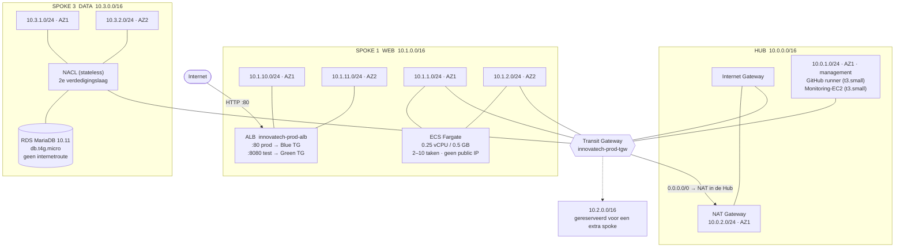

**Uitleg bij het diagram**

- De spokes sturen `0.0.0.0/0` naar de Transit Gateway; de TGW routeert dat naar de
  NAT Gateway in de Hub. Zo is er één uitgaande route voor het hele netwerk.
- Verkeer tussen spokes loopt via de TGW, afgeschermd met Security Groups en NACLs.
- De data-spoke heeft géén Internet Gateway en géén internetroute. Het enige verkeer
  daarheen is MariaDB (3306) vanaf de web-spoke en het management-subnet.
- `10.2.0.0/16` is bewust leeg gelaten: daar kan later een spoke bij zonder dat je het
  bestaande netwerk hoeft aan te passen.

### Componenten en datastromen

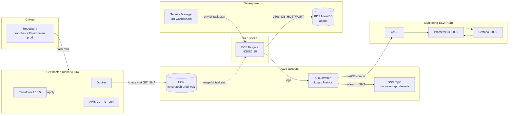

### Rollen en verantwoordelijkheden

| Component | Rol | Wie beheert het |
|---|---|---|
| GitHub (repo, branches, environments) | bron van waarheid, review- en goedkeuringsplek | Mens |
| Self-hosted runner (EC2, Hub) | voert Terraform, Docker, AWS CLI en `jq` uit | Terraform (provisioning) + GitHub (config) |
| Transit Gateway | backbone tussen Hub en spokes | Terraform |
| ALB + ECS Fargate | draait de applicatie, blue-green via CodeDeploy | Terraform voor infra, pipeline voor images |
| RDS MariaDB | relationele data, wachtwoord in Secrets Manager | Terraform |
| Monitoring-EC2 | Prometheus, Grafana, YACE | Terraform |

### Architectuurkeuzes in één oogopslag

- **Hub-and-spoke** met één Transit Gateway, zodat toekomstige spokes zonder bestaand netwerk
  te wijzigen kunnen worden toegevoegd.
- **Eén NAT Gateway** in de Hub in plaats van één per spoke: goedkoper, maar de Hub wordt een
  single point of failure voor uitgaand verkeer.
- **ALB en ECS in dezelfde VPC.** Een ECS-service kan zijn taken niet registreren bij een
  target group in een andere VPC, ook niet via een Transit Gateway.
- **YACE in plaats van `node_exporter`**: Fargate heeft geen host-node die je kunt meten,
  dus CloudWatch-metrics worden naar Prometheus getrokken.

---

## Wat staat waar

| Pad | Requirement | Wat het doet |
|---|---|---|
| `infra/bootstrap` | REQ-06 | Eenmalig: S3-bucket voor de Terraform state (lifecycle `prevent_destroy`) |
| `infra/envs/prod/backend.tf` | REQ-06 | Backend-configuratie: bucket, key `prod/terraform.tfstate`, `use_lockfile` |
| `infra/envs/prod/main.tf` | alle | Provider, tags en de koppeling tussen de vijf modules |
| `infra/envs/prod/variables.tf` | — | `region`, `name`, `alert_email`, `db_multi_az`, `container_image`, `runner_policy_arn` |
| `infra/envs/prod/outputs.tf` | — | Six outputs, o.a. het ALB-adres en het grafana-port-forward-commando |
| `infra/modules/network` | REQ-01, 02 | Hub + web-spoke + data-spoke, TGW, NAT, subnetten, NACL op de data-subnets |
| `infra/modules/web` | REQ-03, 04 | ECR, IAM, ALB met twee listeners, ECS Fargate (min 2 / max 10), autoscaling, blue-green |
| `infra/modules/database` | REQ-02 | RDS MariaDB 10.11, privé, AES256-versleuteld, wachtwoord in Secrets Manager |
| `infra/modules/runner` | REQ-07 | EC2 met Docker, Terraform 1.10.5 en de runner-software; IAM via instance profile |
| `infra/modules/monitoring` | REQ-05 | EC2 met Prometheus + Grafana + YACE, vijf CloudWatch-alarmen, SNS-topic |
| `.github/workflows/infra.yml` | REQ-07 | fmt → validate → plan (PR-commentaar) → apply na goedkeuring op `main` |
| `.github/workflows/app.yml` | REQ-07, 08 | build → smoke test → push naar ECR → nieuwe task definition → CodeDeploy |
| `app/` | REQ-03, 08 | NGINX-image met `/healthz` en `/version.txt` (bevat de commit-SHA) |

### CIDR-overzicht

| Segment | CIDR | AZ | Gebruik |
|---|---|---|---|
| Hub | `10.0.0.0/16` | — | Transit Gateway-attachment |
| Hub public | `10.0.2.0/24` | AZ 1 | NAT Gateway + Internet Gateway |
| Hub management | `10.0.1.0/24` | AZ 1 | GitHub runner, monitoring-EC2 |
| Web-spoke | `10.1.0.0/16` | — | ALB + ECS |
| Web public | `10.1.10.0/24`, `10.1.11.0/24` | AZ 1, AZ 2 | ALB |
| Web private | `10.1.1.0/24`, `10.1.2.0/24` | AZ 1, AZ 2 | ECS Fargate-taken (zonder public IP) |
| Data-spoke | `10.3.0.0/16` | — | RDS |
| Data | `10.3.1.0/24`, `10.3.2.0/24` | AZ 1, AZ 2 | RDS-subnetten |
| Gereserveerd | `10.2.0.0/16` | — | Uitbreidings-spoke (nog niet gebouwd) |

Alle CIDR's staan als defaults in `infra/modules/network/variables.tf`. De twee beschikbare
AZ's worden automatisch opgehaald (`data.aws_availability_zones`, eerste twee).

---

## Prerequisites

### Op je laptop (voor `terraform`, `docker` en `git`)

| Tool | Versie | Waarvoor | Controleer met |
|---|---|---|---|
| Terraform | `>= 1.10.0` | `use_lockfile` in de S3-backend bestaat pas vanaf 1.10 | `terraform version` |
| AWS CLI | v2 | SSM-sessies, output van de bootstrap | `aws --version` |
| Docker | 24+ | lokaal de image bouwen en testen | `docker --version` |
| jq | 1.6+ | **verplicht in `app.yml`** voor de task-definition | `jq --version` |
| Git | actueel | repo klonen en pushen | `git --version` |

`jq` staat ook op de runner zelf (`infra/modules/runner/user_data.sh`), maar voor lokaal
testen van de workflow-commando's heb je hem zelf nodig.

### Op de runner (wordt door `user_data.sh` geïnstalleerd, niet door jou)

Docker, Git, jq, unzip, Terraform 1.10.5 en de GitHub Actions-runner. De AMI is Amazon Linux
2023 (`/aws/service/ami-amazon-linux-latest/al2023-ami-kernel-default-x86_64`, opgehaald via
SSM Parameter Store, dus je AMI-update krijg je automatisch).

### AWS-account

- E-mailadres geverifieerd en een geldige betaalmethode, anders kan RDS de instance niet starten.
- Regio `eu-west-1` met RDS MariaDB 10.11 (`db.t4g.micro`) beschikbaar.
- Rechten om IAM-roles, VPC's, EC2, RDS en SNS aan te maken. De runner krijgt standaard
  `AdministratorAccess` — zie [Bekende beperkingen](#bekendebeperkingen-en-operationele-aandachtspunten).
- Limieten: VPC's per regio, Elastic IP's, en de standaard limiet van 20 instances per regio.
  Deze omgeving gebruikt er vier (runner, monitoring, 2+ ECS-taken).
- Een **privé** GitHub-repo met Actions ingeschakeld en admin-rechten, want je maakt zelf een
  Environment, branch protection en een self-hosted runner aan.

---

## Eerste keer opzetten

De runner draait in het netwerk dat Terraform zelf bouwt. De eerste apply moet daarom
handmatig; daarna loopt alles via GitHub.

### Volgorde van de opzet

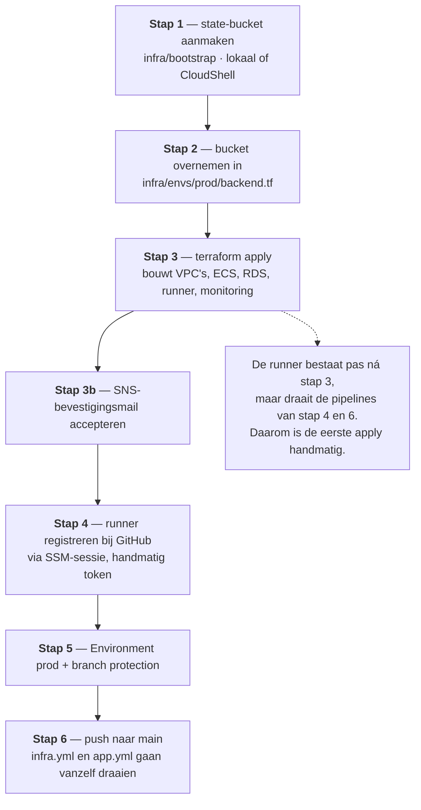

De volgorde is niet willekeurig: stap 2 moet vóór stap 3, omdat `terraform init` de backend
vastlegt. En stap 4 kan pas ná stap 3, omdat de runner door Terraform wordt aangemaakt.

### Stap 1 — Maak de state-bucket (eenmalig, lokaal of in AWS CloudShell)

```bash
cd infra/bootstrap
terraform init
terraform apply -var state_bucket_name=innovatech-tfstate-<jouwnaam>-<getal>
```

De bucketnaam moet wereldwijd uniek zijn. Noteer de naam uit de output.

### Stap 2 — Zet dezelfde bucket in `backend.tf`

Open `infra/envs/prod/backend.tf` en vervang de `bucket`-waarde door de naam uit stap 1.
De backend wordt tijdens `terraform init` vastgelegd, dus deze wijziging moet vóór stap 3
gebeuren. De regio en de key (`prod/terraform.tfstate`) blijven hetzelfde.

### Stap 3 — Bouw de omgeving (eenmalig handmatig, duurt ca. 15–25 minuten)

```bash
cd ../envs/prod
terraform init
terraform apply
```

Tijdens of direct na de apply:

1. **Bevestig de SNS-abonnementmail** die AWS naar `alert_email` stuurt. Zonder bevestiging
   ontvang je geen alarmmeldingen.
2. Controleer de output:

```bash
terraform output                      # alle outputs
terraform output alb_dns_name         # http://<waarde> opent de site
```

### Stap 4 — Registreer de runner bij GitHub (eenmalig handmatig)

Het registratietoken staat bewust niet in Terraform of in de state, dus dit is een handmatige stap.

1. GitHub → repo → **Settings → Actions → Runners → New self-hosted runner**. Kopieer het
   registratietoken (1 uur geldig).
2. Open een sessie op de runner vanaf je laptop (geen SSH nodig):

```bash
cd infra/envs/prod
aws ssm start-session --target $(terraform output -raw runner_instance_id)
```

3. Op de runner:

```bash
ls /var/log/runner-ready          # als dit ontbreekt: user_data is nog niet klaar, wacht even
sudo -iu runner
cd /home/runner/actions-runner
./config.sh --url https://github.com/<owner>/<repo> --token <TOKEN> --labels innovatech --unattended
cd /home/runner/actions-runner
sudo ./svc.sh install runner && sudo ./svc.sh start
exit
```

4. Controleer in GitHub of de runner als *online* verschijnt met de labels
   `self-hosted`, `linux`, `X64` en `innovatech`.

### Stap 5 — Stel de GitHub-beveiliging in

- **Settings → Environments → New environment: `prod`**. Voeg jezelf toe als **Required
  reviewer**. Dit is de handmatige goedkeuring voor zowel `apply` als `deploy`.
- **Settings → Branches → Add rule** voor `main`: verplicht een pull request, en schakel
  *Require status checks* in zodat een mislukte `plan` een merge blokkeert.

### Stap 6 — Pushen

```bash
git remote add origin https://github.com/<owner>/<repo>.git
git push -u origin main
```

Verwacht gedrag: `infra.yml` draait en toont een plan (nog zonder wijzigingen). Elke
wijziging onder `app/` start daarna `app.yml`.

---

## Terraform-outputs

| Output | Gebruik |
|---|---|
| `alb_dns_name` | Het publieke adres van de site: `http://<waarde>` |
| `ecr_repository_url` | Registry waar `app.yml` de image naartoe pusht |
| `rds_endpoint` | Hostnaam van MariaDB, alleen bereikbaar vanuit web-spoke en management |
| `runner_instance_id` | Doel van `aws ssm start-session` |
| `monitoring_instance_id` | Doel van de port-forward-sessie naar Grafana |
| `grafana_port_forward` | Het volledige commando, inclusief poortmappings |

```bash
cd infra/envs/prod
terraform output -json          # machineleesbaar
terraform output grafana_port_forward
```

---

## Terraform: modules en afhankelijkheden

`infra/envs/prod/main.tf` is de enige plek waar de modules aan elkaar gekoppeld worden. Zo
zie je in één oogopslag wie wat nodig heeft.

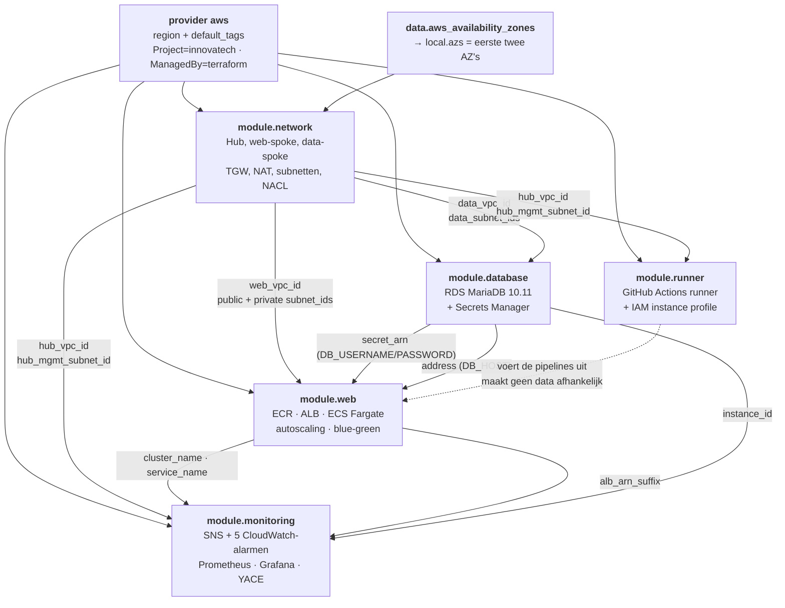

De koppeling `network → database → web → monitoring` is de ruggengraat: zonder de netwerk-
module is er geen VPC, zonder `database` heeft de web-module geen secret, en zonder `web`
weet het monitoring-EC2 niet welke cluster en load balancer het moet volgen.

---

## Hoe wijzig ik X

De meest voorkomende aanpassingen, met de plek waar je ze moet doorvoeren.

### Regio wijzigen

De regio staat op **vier** plekken hardcoded. Verander ze alle vier, anders bouw je resources in
de ene regio en verwijst de pipeline naar de andere:

| Bestand | Wat |
|---|---|
| `infra/envs/prod/terraform.tfvars` | `region` |
| `infra/envs/prod/backend.tf` | `backend "s3"` → `region` (en de bucket in die regio) |
| `.github/workflows/infra.yml` | `env.AWS_REGION` en `env.AWS_DEFAULT_REGION` |
| `.github/workflows/app.yml` | idem |

`infra/bootstrap/variables.tf` heeft `eu-west-1` als default en wordt per aanroep meegegeven.

### Naam-prefix wijzigen

`name` bepaalt de namen van alle resources én de ECR-/CodeDeploy-namen die de pipeline
gebruikt. De workflows hebben een **kopie** van deze waarde:

| Bestand | Wat |
|---|---|
| `infra/envs/prod/terraform.tfvars` | `name = "innovatech-prod"` |
| `.github/workflows/app.yml` | `env.NAME_PREFIX` |

Verander beide tegelijk. Een mismatch geeft een foutmelding bij
`describe-task-definition` of `create-deployment`.

### Waarden aanpassen

| Wil je | Variabele | Huidige waarde |
|---|---|---|
| Een ander e-mailadres voor alarms | `alert_email` (`terraform.tfvars`) | vastgezet op jouw adres |
| Database zonder Multi-AZ (goedkoper) | `db_multi_az` | staat al op `false` |
| Kleinere of grotere taken | `min_tasks`, `max_tasks`, `container_cpu`, `container_memory` in `modules/web` | 2, 10, 256, 512 |
| Strengere toegangsrechten voor de runner | `runner_policy_arn` | `AdministratorAccess` |
| Andere database-instance | `instance_class` in `modules/database` | `db.t4g.micro` |
| Handmatig naar de blue-green-omgeving kijken | `test_access_cidrs` in `modules/web` | `[]` (niemand) |

> **`test_access_cidrs` staat standaard leeg**, waardoor de testlistener op poort 8080 alleen
> intern bereikbaar is. CodeDeploy gebruikt die listener zelf tijdens een deployment, dus
> automatische blue-green blijft werken. Wil je de Green-taken handmatig bekijken, zet dan je
> eigen publieke CIDR (bijvoorbeeld `/32`) in deze variabele en `apply` opnieuw.

### Een extra spoke toevoegen

Kopieer het web- of data-spoke-blok plus de bijbehorende TGW-attachment in
`infra/modules/network/main.tf`. Het netwerkcommentaar bovenin dat bestand beschrijft de
afspraken; `10.2.0.0/16` is daarvoor al gereserveerd.

---

## Hoe een deployment verloopt

### Infrastructuur (`infra.yml`)

Trigger: elke pull request die `infra/**` raakt, en elke push naar `main` die dat doet.

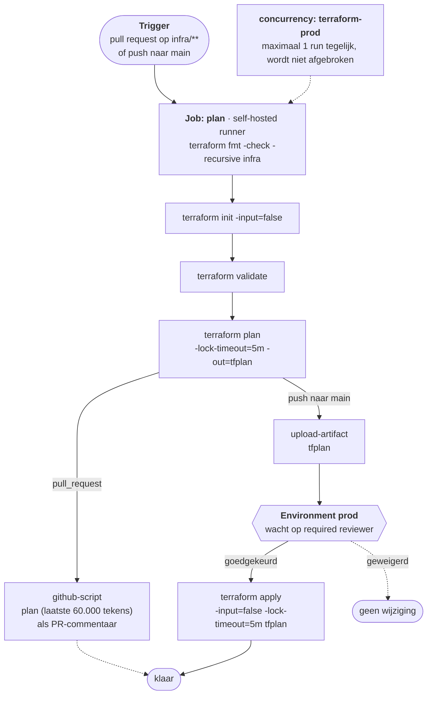

- De apply gebruikt het **goedgekeurde planbestand**, niet een nieuw plan. Wat je hebt
  goedgekeurd is dus exact wat er wordt uitgevoerd.
- Er draait maximaal één run tegelijk (`concurrency: terraform-prod`), en een lopende run
  wordt niet afgebroken.
- Handmatig starten kan met **Actions → Infrastructure → Run workflow**.

### Applicatie (`app.yml`)

Trigger: elke push naar `main` die `app/**` raakt. Let op: `app.yml` draait **niet** op
pull requests, dus de build wordt pas getest op `main`.

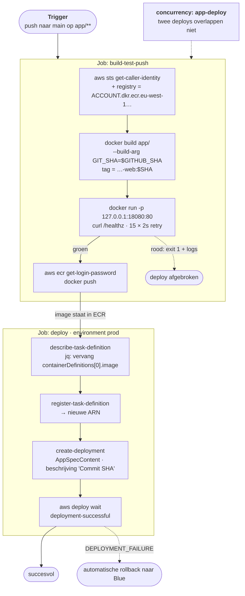

- De image-tag is de commit-SHA, dus een image is nooit dubbelzinnig.
- De health check in `build-test-push` is de enige gate: bij een rood resultaat gaat er niets
  naar ECR en start het deploy-job helemaal niet.
- Bij een mislukte deployment rolt CodeDeploy automatisch terug
  (`auto_rollback_configuration` op `DEPLOYMENT_FAILURE`).
- Ook `app.yml` gebruist `concurrency: app-deploy`, dus twee deploys overlappen niet.

### Blue-green in detail

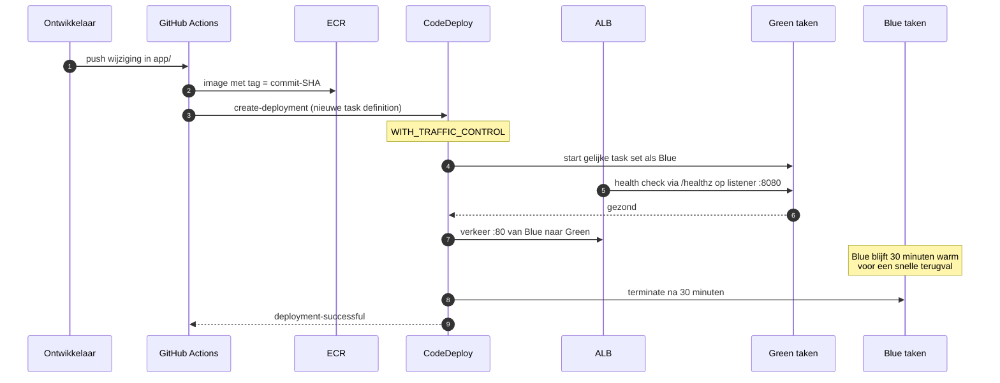

De twee listeners zijn belangrijk: poort 80 (prod) wijst naar de Blue-target-group en wordt
door CodeDeploy omgezet, poort 8080 (test) wijst naar Green en wordt gebruikt om de nieuwe
taken te valideren vóór het verkeer overschakelt. Terraform heeft op beide listeners
`ignore_changes = [default_action]`, zodat het de schakeling van CodeDeploy niet terugdraait.

### Herleidbaarheid (REQ-08)

De commit-SHA zit op drie plekken en is overal terug te vinden:

| Plek | Weergave |
|---|---|
| ECR-image-tag | `innovatech-prod-web:<sha>` |
| CodeDeploy-deployment | `--description "Commit <sha>"` |
| `/version.txt` op de site | de SHA, opgehaald door `index.html` |

---

## Lokaal ontwikkelen en testen

### De applicatie-image lokaal bouwen en testen

Dit is dezelfde test als in `app.yml`, maar zonder AWS. Doe dit vóór elke push.

```bash
cd app
docker build -t innovatech-app:local --build-arg GIT_SHA=$(git rev-parse --short HEAD) .
docker run -d --name innovatech-app -p 8080:80 innovatech-app:local

curl -fsS http://localhost:8080/healthz        # moet "ok" teruggeven
curl -fsS http://localhost:8080/version.txt     # moet de SHA zijn

docker rm -f innovatech-app
```

Werkt dit niet lokaal, dan zal `app.yml` ook falen: de health check is de enige gate vóór
de push naar ECR.

### Terraform lokaal controleren

De CI draait `fmt -check -recursive infra`. Draai datzelfde lokaal, anders faalt de pipeline
op een schoon, cosmetisch verschil:

```bash
terraform fmt -recursive infra           # formatteert
terraform fmt -check -recursive infra    # controleer alleen, exit 1 bij verschillen
cd infra/envs/prod && terraform init -backend=false && terraform validate
```

Met `-backend=false` valideer je zonder de state-bucket aan te raken.

### Een plan bekijken zonder iets te deployen

```bash
cd infra/envs/prod
terraform plan -out=tfplan
terraform show tfplan | less
```

Gebruik `-lock-timeout=5m` (zoals de CI) als de state-lock door een parallelle run bezet is.
Verwijder `tfplan` daarna; het bestand staat in `.gitignore`.

---

## Testplan en acceptatie

Voer dit uit na de eerste apply. Voeg de resultaten toe aan je testplan.

| # | Test | Hoe | Verwacht |
|---|---|---|---|
| 1 | Site bereikbaar (REQ-03) | `curl -i http://$(terraform output -raw alb_dns_name)` | `200`, met de commit-SHA op de pagina |
| 2 | DB niet publiek bereikbaar (REQ-01, 02) | Vanaf je laptop: `mysql -h $(terraform output -raw rds_endpoint) -u dbadmin -p` | Timeout: geen route vanaf internet |
| 3 | DB bereikbaar vanuit de VPC (REQ-02) | Vanaf de runner (via SSM): `nc -zv $(terraform output -raw rds_endpoint) 3306` | `succeeded` |
| 4 | Health check (REQ-03) | `curl -fsS http://$(terraform output -raw alb_dns_name)/healthz` | `ok` |
| 5 | Autoscaling (REQ-04) | `docker run --rm williamyeh/hey -z 10m -c 200 http://$(terraform output -raw alb_dns_name)/` | Taken gaan van 2 naar 4 na ~5 min boven 70% CPU, en na afloop terug naar 2 |
| 6 | CPU-alarm (REQ-05) | Zelfde loadtest | Mail via SNS na 5 minuten boven 70% |
| 7 | 5xx-alarm (REQ-05) | Zet tijdelijk `health_check_path = /healthz` **en** blokkeer die route, of verwijder tijdelijk de taken | Mail via SNS bij >1% 5xx |
| 8 | Blue-green (REQ-03) | Wijzig `app/html/index.html`, push naar `main`, volg de deployment in de CodeDeploy-console | Green wordt gezond, verkeer schakelt om, `version.txt` toont de nieuwe SHA |
| 9 | Terugrollen (REQ-03) | Start handmatig een deployment met een kapotte image | CodeDeploy rolt terug naar Blue |
| 10 | Failure recovery (REQ-04, 07) | Stop één taak handmatig in de ECS-console; stop daarna `sudo ./svc.sh stop` op de runner | ECS start een nieuwe taak; pipelines blijven `pending` tot de runner terug is |
| 11 | Secret-rolverdeling (REQ-02) | Start een taak en inspecteer de env-vars | `DB_USERNAME` en `DB_PASSWORD` zijn gevuld, `DB_HOST` wijst naar de RDS-endpoint |
| 12 | Versie-herleidbaarheid (REQ-08) | Vergelijk de tag in ECR met `/version.txt` | Identieke SHA |

Voor test 7 is een schone manier om 5xx te veroorzaken: zet in `modules/web/variables.tf`
tijdelijk `health_check_path = "/does-not-exist"`. De taken blijven dan gezond voor ECS, maar
de target group markeert ze unhealthy.

---

## Monitoring en dashboards

### Architectuur en meetketen

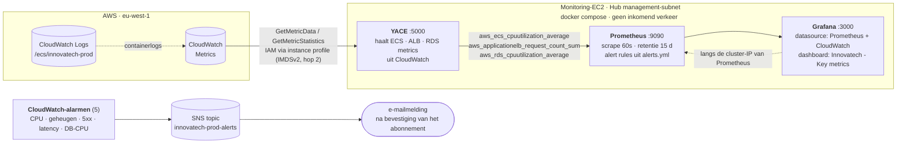

YACE is nodig omdat `node_exporter` niet werkt op Fargate: er is geen host-node om te meten.
YACE exposeert de CloudWatch-metrics als Prometheus-metrics, waarvan de namen in
`alerts.yml` worden gebruikt (`aws_ecs_cpuutilization_average`,
`aws_applicationelb_request_count_sum`, enz.).

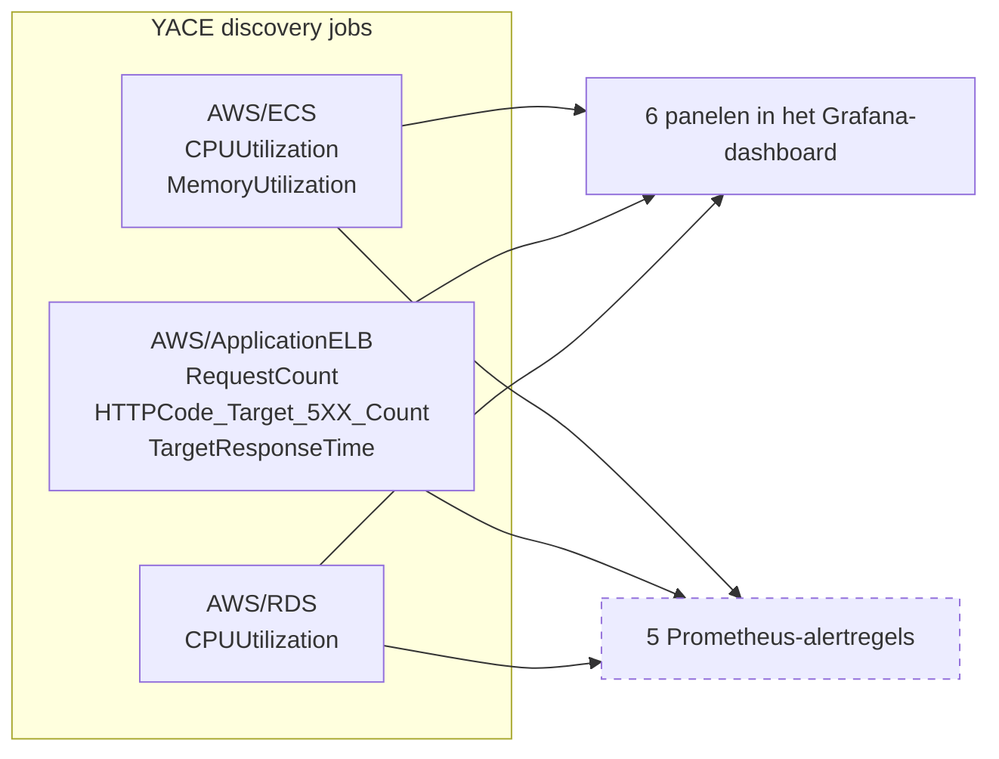

De stippellijn staat voor de belangrijkste nuance: de Prometheus-regels zijn een **aanvullende,
zichtbare kopie** in de Prometheus-UI. Alleen CloudWatch + SNS stuurt een mailmelding.

### CloudWatch-alarmen (met e-mail via SNS)

| Alarm | Drempel | Duur | Extra actie |
|---|---|---|---|
| `cpu-high` | ECS CPU > 70% | 5 minuten | — |
| `memory-high` | ECS geheugen > 80% | 5 minuten | — |
| `alb-5xx-rate` | > 1% van de requests | 1 minuut | — |
| `target-response-time` | ALB > 0,5 s gemiddeld | 3 minuten | — |
| `db-cpu-high` | RDS CPU > 85% | 5 minuten | — |

Let op: de CPU-schaling in `modules/web` heeft een **eigen** alarmset (`scale-out-cpu-high` en
`scale-in-cpu-low`) met dezelfde drempels, maar die stuurt geen mail — die stuurt een
schaalactie. `cpu-high` in de monitoring-module is wél de variant met de mailmelding. Twee
alarmen op dezelfde metriek is verwarrelijk om te debuggen; het staat zo omdat de
schaalbeslissingen en de notificatie los van elkaar mogen evolueren.

### Grafana en Prometheus openen

Beide poorten zitten achter een security group zonder inbound regels, dus je bereikt ze via
een SSM-port-forward.

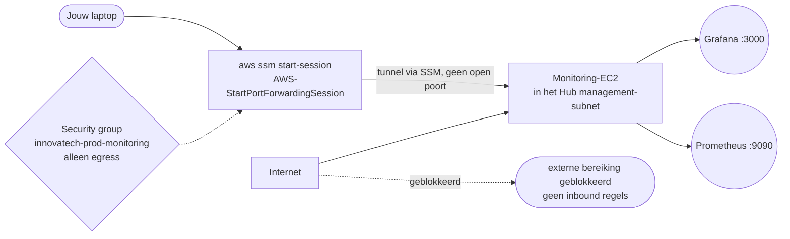

Grafana is al als output beschikbaar:

```bash
cd infra/envs/prod
terraform output grafana_port_forward
# daarna: http://localhost:3000
```

Voor Prometheus moet je het commando zelf samenstellen (er is geen output voor):

```bash
aws ssm start-session \
  --target $(terraform output -raw monitoring_instance_id) \
  --document-name AWS-StartPortForwardingSession \
  --parameters portNumber=9090,localPortNumber=9090
# daarna: http://localhost:9090
```

- Grafana: gebruiker `admin`, wachtwoord `admin` (Grafana-OSS-default). Grafana dwingt bij
  de eerste login een wachtwoordwijziging af.
- Het dashboard heet **Innovatech - Key metrics** en bevat zes panelen: CPU, geheugen,
  5xx-rate, responstijd, requests per minuut en database-CPU.
- Application logs van de Fargate-taken staan in CloudWatch Logs in de log group
  `/ecs/innovatech-prod` (retentie 14 dagen).

---

## Afwijkingen t.o.v. het ontwerpdocument

Neem deze punten over in je as-built documentatie.

1. **ALB in de web-spoke, niet in de Hub.** Een ECS-service kan zijn taken niet registreren
   bij een target group in een andere VPC. De Hub bevat daarom alleen NAT, runner en
   monitoring. De web-spoke heeft dus ook publieke subnets.
2. **Twee subnets per laag.** Zowel de ALB als RDS Multi-AZ vereisen minimaal twee
   beschikbare AZ's; `local.azs` in `infra/envs/prod/main.tf` pakt de eerste twee.
3. **Security Groups per module en CIDR-regels tussen VPC's.** Verwijzen naar een security
   group in een andere VPC werkt niet via een Transit Gateway, dus de database-regels
   gebruiken CIDR's. `publicly_accessible = false` is de RDS-tegenhanger van
   `associate_public_ip_address`.
4. **Beheer via SSM Session Manager** in plaats van een bastion of VPN: geen enkele
   inkomende poort, ook geen SSH. IMDSv2 staat aan (`http_tokens = "required"`).
5. **Monitoring via YACE.** `node_exporter` werkt niet op Fargate. De Prometheus-alertregels
   zijn aanvullend; alleen CloudWatch + SNS stuurt mail.
6. **State locking via S3** (`use_lockfile`, Terraform >= 1.10) in plaats van een DynamoDB-tabel.
7. **Secrets via de execution role.** De *execution role* haalt het wachtwoord op bij het
   starten van de taak; de *task role* heeft daarnaast leestoegang voor de applicatie zelf.
   Het wachtwoord staat nooit in code of state.
8. **Health check begint op `/`.** Het startimage (`public.ecr.aws/nginx/nginx`) kent geen
   `/healthz`. Onze eigen image biedt beide; pas `health_check_path` eventueel aan.
9. **Spoke 2 (`10.2.0.0/16`) is niet gebouwd**, alleen gereserveerd.

---

## Bekende beperkingen en operationele aandachtspunten

### Beveiliging

- **Alleen HTTP.** De ALB luistert op poort 80. HTTPS vereist een domeinnaam plus een
  ACM-certificaat, en een listener-wijziging.
- **TLS is niet afgedwongen op de database.** Controleer of `require_secure_transport`
  ondersteund wordt voor MariaDB 10.11 en voeg een `parameter_group` toe als je dat wilt.
- **De runner heeft `AdministratorAccess`.** Dat is lab-gemak. Verscherp dit naar een
  least-privilege-beleid; denk aan `AmazonEC2ContainerRegistryPushOnly`,
  `AmazonECS_FullAccess`, `CloudWatchLogsRead` en de S3-acties voor de state.
- **De TGW staat standaard alle spoke-naar-spoke routes toe.** De afscherming zit volledig in
  Security Groups en NACLs. Eigene TGW-route tables per attachment geven echte segmentatie.
- **De testlistener op 8080** is met de standaard `test_access_cidrs = []` niet publiek
  bereikbaar. Dat is veilig, maar je kunt de Green-omgeving dan niet handmatig bekijken.
- **Grafana draait met de default credentials.** Voor een echte omgeving: zet
  `GF_SECURITY_ADMIN_PASSWORD` of een OAuth-provider in de compose-bestanden.

### Terraform en GitHub

- **Een infra-apply zet het image terug naar het startimage.** De `aws_ecs_task_definition`
  in `modules/web` heeft géén `lifecycle { ignore_changes = [container_definitions] }`.
  Nadat `app.yml` een nieuwe task definition heeft geregistreerd, zal `terraform plan`
  daarom een wijziging tonen die de image terugzet naar `container_image`
  (`public.ecr.aws/nginx/nginx:stable-alpine`). De volgende push naar `app/` lost het op.
  Wil je dit structureel voorkomen, voeg dan `ignore_changes = [container_definitions]`
  toe aan de task definition.
- **De ECS-service negeert Terraform-wijzigingen** op `task_definition`, `load_balancer` en
  `desired_count` (die beheert CodeDeploy respectievelijk Auto Scaling). Een `plan` toont
  daarom geen wijzigingen als je die waarden aanpast — dat is bedoeld, geen bug.

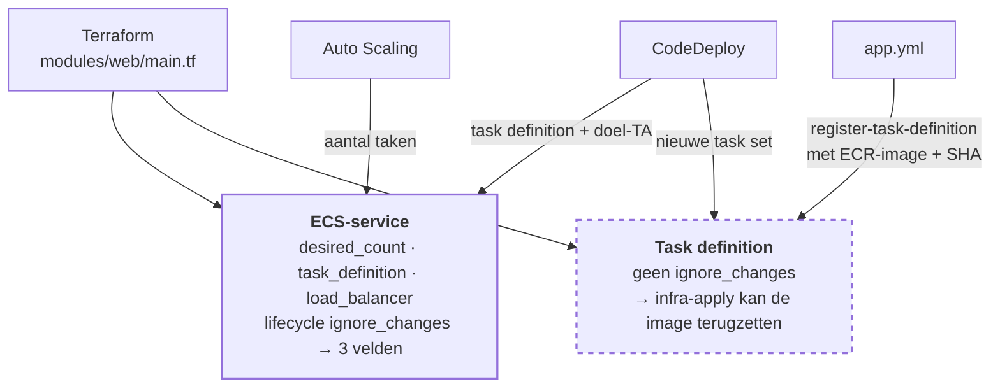

De stippellijn markeert de valkuil uit de vorige bullet: de task definition wordt wél door
Terraform beheerd, terwijl de service die eraan hangt dat niet doet.
- **Een wijziging in de monitoring-bestanden vervangt de EC2-instance.**
  `user_data_replace_on_change = true` betekent dat een wijziging in `dashboard.json`,
  `prometheus.yml`, `alerts.yml` of de templates een nieuwe instance oplevert, met lege
  Prometheus- en Grafana-data.
- **Alle Docker-images in de monitoring-stack zijn `latest`.** Dat is handig bij een lab maar
  niet reproduceerbaar; pin versies voor een stabiele omgeving.
- **De CI gebruikt `actions/github-script` voor het plan-commentaar** en plakt de laatste
  60.000 tekens. Bij een heel groot plan valt het begin dus weg.

### Applicatie

- **De image bevat geen applicatiecode**, alleen een statische pagina. Zie
  [Applicatielaag toevoegen](#applicatielaag-toevoegen).

---

## Applicatielaag toevoegen

De infra geeft de ECS-taak al de vier database-variabelen. Een Flask-app toevoegen is daarom
een kwestie van de image, niet van Terraform:

1. Voeg een Flask-app toe (bijvoorbeeld `app/app.py` met `requirements.txt`).
2. Pas `app/Dockerfile` aan: installeer de dependencies en start Gunicorn op poort 8000.
3. Pas `modules/web/main.tf` aan als de container op een andere poort moet draaien — er zijn
   drie plekken met poort `80`: `containerName`/`ContainerPort` in de task definition, de
   `portMappings`, en beide `aws_lb_target_group`-blokken.
4. Voeg in `app/nginx.conf` een `location /` toe die naar de app proxyt, en houd `/healthz`
   op NGINX-niveau als snelle check.
5. **Laat `/healthz` antwoorden zonder de database.** Anders komt de service niet op uit
   `health_check_grace_period_seconds = 30` als de database traag of onbereikbaar is.
6. Voeg een migratiestap toe (bv. `flask db upgrade`) in de startup, met een retry, want de
   database kan bij een blue-green tijdelijk onbereikbaar zijn.
7. Verhoog `container_memory` als Gunicorn met workers meer dan 512 MB nodig heeft, anders
   raakt de taak in OOM.

---

## Kosten

De grootste kosten ontstaan ook als niemand de site bezoekt.

| Post | Richtlijn |
|---|---|
| RDS Multi-AZ | Ongeveer 2× de prijs van single-AZ voor dezelfde instance |
| NAT Gateway | Vaste kosten per uur plus een bedrag per GB verkeer |
| Transit Gateway | Per attachment per uur, plus verwerkingskosten voor data |
| ALB | Per uur per load balancer, plus LCU's |
| EC2 (runner + monitoring) | Twee `t3.small` |
| EBS (3 volumes) | gp3, 20–30 GB |
| ECS-taken | `0.25 vCPU` / `0.5 GB` per taak, 2–10 taken |

Praktisch: zet `db_multi_az = false` tijdens het bouwen — die staat in
`terraform.tfvars` al op `false`. Controleer je verwachte bedrag in de AWS Pricing
Calculator met de exacte regio, instance-types en het aantal taken dat je verwacht.

---

## Opruimen

```bash
cd infra/envs/prod
terraform destroy
```

Let op:

- De state-bucket heeft `lifecycle { prevent_destroy = true }` en wordt dus **niet** meegedestroyd.
  Verwijder hem daarna handmatig als je klaar bent:
  ```bash
  cd infra/bootstrap
  terraform destroy   # vraagt om bevestiging; verwijder daarna de bucket zelf
  ```
- RDS maakt standaard geen final snapshot (`skip_final_snapshot = true` in
  `modules/database`). Zet dat op `false` als je echte data hebt.
- De EC2-instances en de ECR-repository worden wel verwijderd (`force_delete = true` op de
  repository).
- Verwijder daarna de GitHub Environment, de branch protection en de self-hosted runner; anders
  blijft er een runner met een geldig registratietoken bestaan dat naar een kapotte omgeving wijst.
- De Prometheus- en Grafana-data verdwijnen met de instances.

---

## Troubleshooting

| Symptom | Waarschijnlijke oorzaak en oplossing |
|---|---|
| `fmt -check` faalt in CI | Draai lokaal `terraform fmt -recursive infra` en commit het resultaat |
| Pipeline blijft `pending` | De runner is offline. Start hem met `sudo ./svc.sh start` in `/home/runner/actions-runner`, of verwijder de stale runner in GitHub |
| `terraform apply` met een lock-fout | Er draait een andere run. Wacht of verhoog `-lock-timeout`. Forceer nooit een lock weg tenzij je zeker weet dat er geen run actief is |
| `BucketAlreadyExists` bij stap 1 | Kies een andere `state_bucket_name`; bucketnamen zijn wereldwijd uniek |
| `terraform init` verwijst naar de verkeerde bucket | Pas `bucket` in `infra/envs/prod/backend.tf` aan vóór `terraform init` |
| Geen alarmmails | Accepteer de SNS-bevestigingsmail; controleer daarna of je adres in `alert_email` staat |
| `app.yml` stopt na "Test (container starten)" | De image serveert `/healthz` niet. Test lokaal met `curl` op poort 8080 |
| `No deployment group` of `task definition not found` in `app.yml` | `NAME_PREFIX` in `app.yml` wijkt af van `name` in `terraform.tfvars` |
| ECS-taken blijven `PENDING` | Controleer de security group van de taken, de subnetten en of de execution role het secret mag lezen |
| Grafana geeft geen data | YACE heeft even tijd (scrape-interval 60s) en Prometheus-retentie is 15 dagen. Controleer `http://localhost:9090/targets` |
| `terraform plan` toont een image-revert | Verwacht gedrag, zie [Bekende beperkingen](#bekendebeperkingen-en-operationele-aandachtspunten) |
| Instance wordt telkens vervangen | Je wijzigde een bestand in `modules/monitoring/files` of `templates`; zie dezelfde sectie |

---

## Checklist voor overdracht

- [ ] `terraform.tfvars` gecontroleerd: `alert_email`, `name`, `db_multi_az`
- [ ] Regio consistent in `terraform.tfvars`, `backend.tf` en beide workflows
- [ ] `NAME_PREFIX` in `app.yml` gelijk aan `name` in `terraform.tfvars`
- [ ] `runner_policy_arn` verscherpt van `AdministratorAccess`
- [ ] GitHub Environment `prod` met verplichte reviewer
- [ ] Branch protection op `main` met verplichte pull request
- [ ] SNS-abonnement bevestigd; alarmschakel getest
- [ ] Grafana-wachtwoord gewijzigd
- [ ] Testplan uit [Testplan en acceptatie](#testplan-en-acceptatie) uitgevoerd en resultaten vastgelegd
- [ ] Kosten doorgerekend in de AWS Pricing Calculator
- [ ] Bekende beperkingen uit dit document besproken en geprioriteerd
- [ ] Opruimprocedure getest of in elk geval doorgenomen
